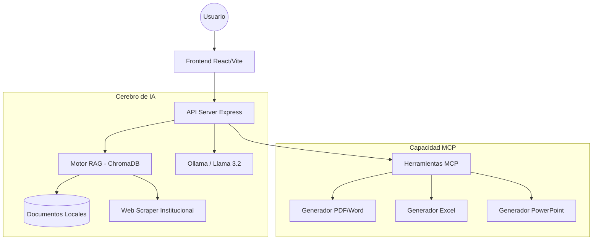

# EPIIS MCP Server: Sistema de Gestión Académica con IA Local

Esta es una estructura profesional para exponer el proyecto, diseñada para dejar claro cómo funciona la tecnología MCP combinada con RAG.

---

## 1. ¿Qué es EPIIS MCP Server?
Es una plataforma inteligente diseñada para la **FIIS (Facultad de Ingeniería en Informática y Sistemas) de la UNAS**. Actúa como un asistente oficial capaz de gestionar documentos académicos, responder consultas institucionales y automatizar tareas administrativas utilizando modelos de lenguaje (IA) que pueden correr 100% de forma local.

---

## 2. Pilares Tecnológicos
El proyecto se basa en dos conceptos clave:
1.  **MCP (Model Context Protocol):** Es el estándar que permite a la IA conectarse con herramientas (generar archivos) y recursos (leer bases de datos).
2.  **RAG (Retrieval-Augmented Generation):** Permite que la IA responda basándose en documentos reales (PDFs, Word) y sitios web oficiales, evitando que la IA "alucine" o invente información.

---

## 3. Arquitectura del Sistema

---

## 4. ¿Cómo funciona? (El Flujo)

1.  **Ingesta:** El sistema lee documentos académicos (sílabos, reglamentos) y hace scraping de la web oficial de la UNAS.
2.  **Indexación:** Esta información se convierte en "vectores" y se guarda en **ChromaDB**.
3.  **Consulta:** Cuando el usuario pregunta "¿Quién es el director?", el sistema busca en la base de datos de vectores la respuesta exacta.
4.  **Respuesta:** La IA (Llama 3.2 via Ollama) recibe la pregunta + los datos encontrados y redacta una respuesta profesional.
5.  **Acción:** Si el usuario pide "Genérame el sílabo", el sistema activa una herramienta MCP para crear un archivo real (.docx, .pdf) basado en la conversación.

---

## 5. Estructura del Código

*   **`/backend`**: El núcleo del servidor.
    *   `src/mcp/`: Implementación del protocolo MCP y herramientas.
    *   `src/services/llm/`: Conexión con Ollama y gestión de modelos.
    *   `src/services/vector/`: Motor de búsqueda semántica (ChromaDB).
    *   `src/services/document/`: Lógica para generar archivos Office y PDF.
*   **`/frontend`**: Interfaz de usuario moderna construida con React y Vite.
*   **`/storage`**: Almacenamiento local de documentos, base de datos y archivos generados.
*   **`.env`**: Archivo único de configuración centralizada (Unificado).

---

## 6. Características Principales (Key Features)

*   **Privacidad Total:** Puede funcionar sin internet usando Ollama local.
*   **Multiformato:** Lee y escribe PDF, Word, Excel y PowerPoint.
*   **Conciencia Institucional:** Sabe sobre autoridades, resoluciones y noticias de la UNAS.
*   **Híbrido:** Puede alternar entre modelos locales o en la nube según la potencia necesaria.
